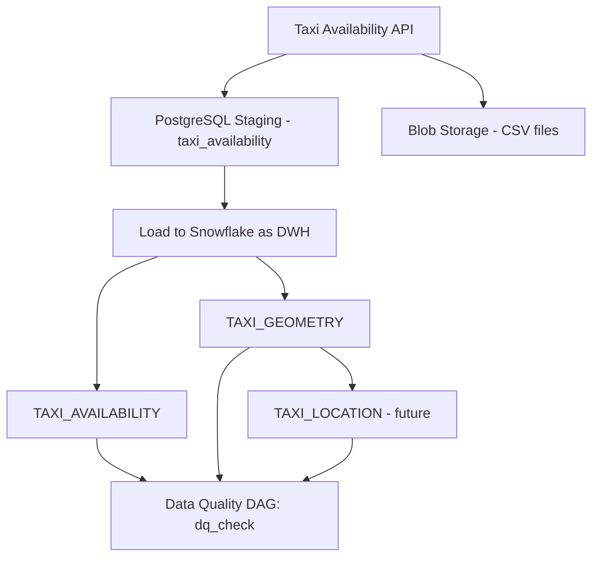

# Taxi Availability Data Pipeline

This project provides a set of Airflow DAGs to extract, transform, and load taxi availability data from an API into a PostgreSQL staging database and Snowflake data warehouse. It also includes data quality checks and prepares the data for downstream visualization.

---

## Project Structure

```

project/
│
├─ dags/
│   ├─ ext_api_get_taxi_availability.py         # Microbatch: API → Postgres
│   ├─ ext_api_get_taxi_availability_csv.py     # Optional CSV extract
│   ├─ load_to_snowflake.py                     # DAG for loading 3 Snowflake tables
│   └─ dq_check.py                              # Data quality DAG
│
├─ functions/
│   ├─ taxi_availability.py                     # API and DB ETL functions
│   └─ dq_function.py                           # Data quality functions
│
├─ files/
│   └─ data/                                   # Local CSV output storage
│
├─ requirements.txt
└─ README.md

````

---

## Dependencies

- Python 3.8+
- Apache Airflow
- Pandas, PyArrow
- PostgreSQL
- Snowflake (Snowflake Connector for Python)
- Requests (for API calls)

**Airflow Connections:**
- `pg1` → PostgreSQL (staging/microbatch)
- `sf1` → Snowflake (DWH)

> These connections should be created in the Airflow UI under **Admin → Connections**, or stored securely using Airflow Secrets backend. Ensure credentials, host, database/schema, and roles are configured correctly for DAGs to run successfully.

---

## DAG Overview


### 1. `ext_api_get_taxi_availability`
- **Frequency:** Every 5 minutes
- **Source:** Taxi availability API
- **Target:** PostgreSQL `taxi_availability` table and CSV in blob storage (local directory to simulate)
- **Description:** Microbatch ETL to ingest new taxi availability data into staging.

### 2. `load_to_snowflake`
- **Frequency:** Triggered after microbatch
- **Target:** Snowflake tables:
  - `TAXI_AVAILABILITY` (general data)
  - `TAXI_GEOMETRY` (coordinates)
  - `TAXI_LOCATION` (future enrichment with reverse geocoding)
- **Notes:** Inserts use batch operations with surrogate DWH keys and load batch IDs for traceability.

### 3. `dq_check`
- **Frequency:** Every 6 hours
- **Target:** Snowflake DWH tables
- **Description:** Performs data quality checks (row counts, nulls, basic consistency) and logs results in Snowflake.

---

## Snowflake Table DDLs

### `TAXI_AVAILABILITY`
```sql
CREATE OR REPLACE TABLE TAXI_AVAILABILITY (
    DWH_ID STRING DEFAULT UUID_STRING() PRIMARY KEY,
    SOURCE_ID STRING,
    CAPTURED_AT TIMESTAMP_NTZ,
    TOTAL_TAXIS INTEGER,
    SOURCE_SYSTEM STRING,
    INGESTED_AT TIMESTAMP_NTZ DEFAULT CURRENT_TIMESTAMP,
    HASH_KEY STRING,
    LOAD_BATCH_ID STRING,
    RECORD_STATUS STRING DEFAULT 'ACTIVE'
);
````

### `TAXI_GEOMETRY`

```sql
CREATE OR REPLACE TABLE TAXI_GEOMETRY (
    DWH_ID STRING DEFAULT UUID_STRING() PRIMARY KEY,
    SOURCE_ID STRING NOT NULL,
    LONGITUDE FLOAT,
    LATITUDE FLOAT,
    LOCATION GEOGRAPHY,
    INGESTED_AT TIMESTAMP_NTZ DEFAULT CURRENT_TIMESTAMP,
    LOAD_BATCH_ID STRING,
    RECORD_STATUS STRING DEFAULT 'ACTIVE'
);
```

### `TAXI_LOCATION` (future enrichment)

```sql
CREATE OR REPLACE TABLE TAXI_LOCATION (
    DWH_ID STRING DEFAULT UUID_STRING() PRIMARY KEY,
    GEOM_ID STRING NOT NULL,
    COUNTRY STRING DEFAULT 'Singapore',
    REGION STRING,
    CITY STRING,
    STREET STRING,
    POSTAL_CODE STRING,
    INGESTED_AT TIMESTAMP_NTZ DEFAULT CURRENT_TIMESTAMP,
    LOAD_BATCH_ID STRING,
    RECORD_STATUS STRING DEFAULT 'ACTIVE'
);
```

---

## Usage

1. Ensure Airflow connections `pg1` (PostgreSQL) and `sf1` (Snowflake) are configured.
2. Place DAG files under `dags/`.
3. Start Airflow scheduler and webserver.
4. Monitor DAG runs in the Airflow UI.
5. Data is available in Snowflake for downstream analytics and Streamlit visualization.

---

## Future Enhancements

* Reverse geocoding for `TAXI_LOCATION` using OpenStreetMap API or offline dataset.
* Additional data quality checks (geospatial consistency, outlier detection).
* Incremental/streaming microbatches for near-real-time updates.


